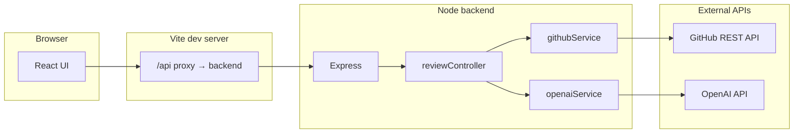

# GitHub Pull Request Reviewer

A full-stack web application that takes a **GitHub pull request URL**, loads the PR metadata and diffs via the **GitHub REST API**, asks **OpenAI** for a structured code review, then **posts comments back to the PR** (inline review comments when GitHub accepts them; otherwise a single PR/issue comment with the full summary).

---

## Table of contents

- [GitHub Pull Request Reviewer](#github-pull-request-reviewer)
  - [Table of contents](#table-of-contents)
  - [Features](#features)
  - [Architecture](#architecture)
  - [Tech stack](#tech-stack)
  - [Repository layout](#repository-layout)
  - [Prerequisites](#prerequisites)
  - [Configuration](#configuration)
    - [Step 1: Create `backend/.env`](#step-1-create-backendenv)
    - [Step 2: Environment variables](#step-2-environment-variables)
  - [GitHub token permissions](#github-token-permissions)
    - [Classic personal access token](#classic-personal-access-token)
    - [Fine-grained personal access token](#fine-grained-personal-access-token)
  - [Installation](#installation)
  - [Running the application](#running-the-application)
    - [Development (two terminals)](#development-two-terminals)
    - [Production build (frontend only)](#production-build-frontend-only)
    - [Backend production start](#backend-production-start)
  - [Using the web UI](#using-the-web-ui)
  - [HTTP API reference](#http-api-reference)
    - [`GET /api/health`](#get-apihealth)
    - [`POST /api/review-pr`](#post-apireview-pr)
  - [Review pipeline](#review-pipeline)
  - [Production deployment](#production-deployment)
  - [Troubleshooting](#troubleshooting)
  - [Security](#security)
  - [Scripts reference](#scripts-reference)
  - [License](#license)

---

## Features

| Area | Details |
|------|---------|
| **Frontend** | React + TypeScript + Tailwind; PR URL input; loading and success/error states; activity log (server + client messages). |
| **Validation** | Debounced PR URL validation (`https://github.com/{owner}/{repo}/pull/{number}`). |
| **Resilience** | Client-side retries with backoff on failed review requests. |
| **Backend** | Express `POST /api/review-pr`; modular `githubService`, `openaiService`, `reviewController`. |
| **AI output** | JSON array: `{ file, line, comment }` per finding. |
| **GitHub** | Inline PR review comments on the PR head; fallback issue comment if no inline comment succeeds. |

---

## Architecture



In **development**, the frontend talks to the same origin (`localhost:5173`); Vite forwards `/api/*` to the Express server (default `http://localhost:3001`). In **production**, you typically serve the built static files and point the UI at your API base URL (or put both behind one reverse proxy).

---

## Tech stack

| Layer | Technologies |
|--------|----------------|
| **Frontend** | React 18, TypeScript, Vite 5, Tailwind CSS 3 |
| **Backend** | Node.js 18+ (native `fetch`), Express 4, ES modules |
| **AI** | Official [`openai`](https://www.npmjs.com/package/openai) npm package (Chat Completions) |
| **GitHub** | REST API v3 (`api.github.com`), `Bearer` token, `X-GitHub-Api-Version` header |

---

## Repository layout

```text
pr-revewer-agent-githuh/
├── .env.example              # Template for secrets (copy to backend/.env)
├── README.md                 # This file
├── backend/
│   ├── server.js             # Express app, CORS, routes, loads backend/.env
│   ├── controllers/
│   │   └── reviewController.js
│   └── services/
│       ├── githubService.js  # URL parse, PR/files fetch, comments
│       └── openaiService.js  # Prompt + structured JSON review
└── frontend/
    ├── vite.config.ts        # Dev server + /api proxy
    ├── src/
    │   ├── App.tsx           # Main UI, retries, logs
    │   ├── hooks/useDebouncedValue.ts
    │   └── lib/prUrl.ts      # URL validation helpers
    └── …
```

Environment variables are read only from **`backend/.env`** (path resolved next to `server.js`), not from the repo root.

---

## Prerequisites

- **Node.js 18 or newer** (required for global `fetch` in the backend).
- **npm** (or compatible client) to install dependencies.
- A **GitHub account** and a token with rights to read the target repo and create PR/issue comments (see [GitHub token permissions](#github-token-permissions)).
- An **OpenAI API key** with access to the model you configure (default: `gpt-4o-mini`).

---

## Configuration

### Step 1: Create `backend/.env`

Copy the example file into the backend folder (do not commit real secrets):

```bash
cp .env.example backend/.env
```

### Step 2: Environment variables

| Variable | Required | Description |
|----------|----------|-------------|
| `GITHUB_TOKEN` | **Yes** | GitHub personal access token (classic or fine-grained) used for all GitHub API calls. |
| `OPENAI_API_KEY` | **Yes** | OpenAI API secret key. |
| `PORT` | No | HTTP port for the API. Default: `3001`. |
| `CORS_ORIGIN` | No | Allowed browser origin for CORS (e.g. `http://localhost:5173`). If unset, the server reflects a permissive default suitable for local dev; set explicitly in production. |
| `OPENAI_MODEL` | No | Chat model id. Default: `gpt-4o-mini`. |

Example `backend/.env`:

```env
GITHUB_TOKEN=ghp_xxxxxxxx
OPENAI_API_KEY=sk-xxxxxxxx
PORT=3001
CORS_ORIGIN=http://localhost:5173
OPENAI_MODEL=gpt-4o-mini
```

---

## GitHub token permissions

Requirements depend on repository visibility and token type.

### Classic personal access token

For **private** repositories, use a token with the **`repo`** scope so the app can read pull requests and create comments.

For **public** repositories only, narrower scopes may work in some setups, but **`repo`** is the simplest choice for an MVP that must always read PRs and post comments.

### Fine-grained personal access token

Grant access to the repositories you need, with permissions such as:

- **Contents:** read (to resolve PR context as needed by the API)
- **Pull requests:** read and write (read PR + files; create review/issue comments)

Consult [GitHub’s documentation on token scopes](https://docs.github.com/en/authentication/keeping-your-account-and-data-secure/managing-your-personal-access-tokens) if your organization enforces restrictions.

---

## Installation

From the repository root:

```bash
cd backend && npm install
cd ../frontend && npm install
```

---

## Running the application

### Development (two terminals)

**1. API server**

```bash
cd backend
npm run dev
```

Uses `node --watch` to restart on file changes. Listens on `PORT` (default **3001**).

**2. Frontend**

```bash
cd frontend
npm run dev
```

Opens the Vite dev server (default **http://localhost:5173**). Requests to `/api/*` are proxied to the backend (see `frontend/vite.config.ts`).

### Production build (frontend only)

```bash
cd frontend
npm run build
```

Static output is in `frontend/dist/`. Serve that folder with any static host and ensure the browser can reach the backend (same host + reverse proxy, or set `CORS_ORIGIN` and configure the frontend to call your API base URL; the stock dev UI uses relative `/api` paths).

### Backend production start

```bash
cd backend
npm start
```

Use a process manager (systemd, PM2, Docker, etc.) and inject `backend/.env` or environment variables from your secret store.

---

## Using the web UI

1. Open the app in the browser (dev: **http://localhost:5173**).  
2. Paste a full GitHub PR URL, for example:  
   `https://github.com/facebook/react/pull/12345`  
3. Click **Start review** and wait until the request finishes.  
4. Inspect **Activity log** for server-side steps and any client retry messages.  
5. On success, open the PR on GitHub: you should see **inline review comments** and/or a **single summary comment** if every inline attempt failed.

The UI validates the URL shape (debounced). **Retry** appears after an error and re-runs the same flow.

---

## HTTP API reference

Base URL in development (via proxy): same origin as the Vite app, paths under `/api`.

### `GET /api/health`

Liveness check.

**Response** `200`

```json
{ "ok": true }
```

---

### `POST /api/review-pr`

Runs the full review: parse URL → GitHub PR + files → OpenAI → GitHub comments.

**Headers**

- `Content-Type: application/json`

**Body**

```json
{
  "prUrl": "https://github.com/owner/repo/pull/42"
}
```

**Success** `200`

```json
{
  "ok": true,
  "owner": "owner",
  "repo": "repo",
  "pullNumber": 42,
  "prTitle": "…",
  "suggestionsCount": 5,
  "postedInlineCount": 3,
  "fallbackPosted": false,
  "postedInline": [{ "file": "src/app.ts", "line": 10 }],
  "inlineErrors": [{ "file": "src/app.ts", "line": 99, "message": "…" }],
  "logs": ["[ISO8601] …", "…"]
}
```

| Field | Meaning |
|--------|---------|
| `suggestionsCount` | Number of AI items returned after parsing. |
| `postedInlineCount` | How many inline PR review comments GitHub accepted. |
| `fallbackPosted` | `true` if **zero** inline comments succeeded but there were suggestions; a single issue/PR comment was posted instead. |
| `postedInline` | Successfully created inline comments (file + line). |
| `inlineErrors` | Items GitHub rejected (wrong line, path, permissions, etc.). |
| `logs` | Timestamped log lines for debugging or UI display. |

**Client errors** `400`

Missing or invalid `prUrl`, or invalid URL format.

```json
{
  "ok": false,
  "error": "…",
  "logs": []
}
```

**Server / upstream errors** `4xx` / `5xx`

GitHub or OpenAI failures surface with `ok: false` and an `error` message when handled in the controller; `logs` may contain prior steps.

---

## Review pipeline

1. **Parse URL** — Expects `github.com/{owner}/{repo}/pull/{number}` (http/https allowed).  
2. **GitHub: pull request** — Fetches title, body, head `commit_id`.  
3. **GitHub: changed files** — Lists files with patches (paginated); large aggregated text may be truncated before the model (see `openaiService.js`).  
4. **OpenAI** — System prompt: senior engineer code review; user message includes title, description, and diffs. Model must return **only** a JSON **array** of `{ "file", "line", "comment" }`.  
5. **GitHub: comments** — For each suggestion, creates a [pull request review comment](https://docs.github.com/en/rest/pulls/comments#create-a-review-comment-for-a-pull-request) on the PR head (`side: RIGHT`). If **none** succeed, creates one [issue comment](https://docs.github.com/en/rest/issues/comments#create-an-issue-comment) on the PR with a markdown summary.

**Line numbers:** GitHub expects the line to exist on the **right-hand** side of the diff for that commit. The model is instructed accordingly; mismatches still produce entries in `inlineErrors`.

---

## Production deployment

- Run the backend on a reachable host; restrict `CORS_ORIGIN` to your real front-end origin.  
- Do not expose `OPENAI_API_KEY` or `GITHUB_TOKEN` to the browser; only the backend uses them.  
- Serve `frontend/dist` over HTTPS in production.  
- If the UI is not on the same host as the API, configure your build or server so API calls hit the correct base URL (the stock Vite app uses relative `/api` paths, which assume a shared reverse proxy or same-origin deployment).

---

## Troubleshooting

| Symptom | Things to check |
|---------|------------------|
| `401` / `403` from GitHub | Token expired, missing `repo` / pull-request permissions, or fine-grained token not allowed on that repo. |
| Inline comments fail, fallback only | Model line numbers not on changed lines; binary files; or GitHub rejecting `path`/`line`. See `inlineErrors` in the API response. |
| `OPENAI_API_KEY is not set` | `backend/.env` missing or wrong path; ensure you run the server from any cwd (env is loaded from `backend/.env` next to `server.js`). |
| CORS errors in browser | Set `CORS_ORIGIN` to your exact front-end origin (scheme + host + port). |
| Empty or invalid AI JSON | Rare model drift; retry or switch `OPENAI_MODEL`. Invalid JSON throws in `openaiService.js` and returns an error response. |
| Frontend cannot reach API | Dev: confirm backend on port 3001 and Vite proxy in `vite.config.ts`. Prod: proxy or CORS as above. |

---

## Security

- **Never** commit `backend/.env` or real tokens to git. The template is `.env.example` only.  
- **Never** embed `GITHUB_TOKEN` or `OPENAI_API_KEY` in frontend code or public repos.  
- Rotate tokens if they leak. Prefer fine-grained tokens scoped to specific repositories when possible.  
- This MVP is intended for **trusted operators**; it does not implement multi-user auth, rate limiting, or PR allowlists. Harden before exposing to the public internet.

---

## Scripts reference

| Location | Command | Purpose |
|----------|---------|---------|
| `backend` | `npm run dev` | Start API with `node --watch`. |
| `backend` | `npm start` | Start API once (`node server.js`). |
| `frontend` | `npm run dev` | Vite dev server + HMR. |
| `frontend` | `npm run build` | Typecheck + production bundle to `dist/`. |
| `frontend` | `npm run preview` | Preview the production build locally. |

---

## License

Add a `LICENSE` file for your project if you distribute or open-source this code.
